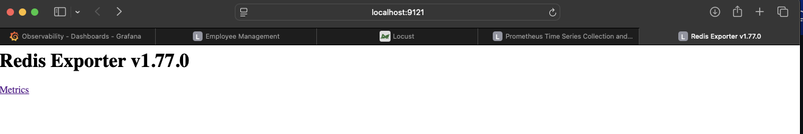
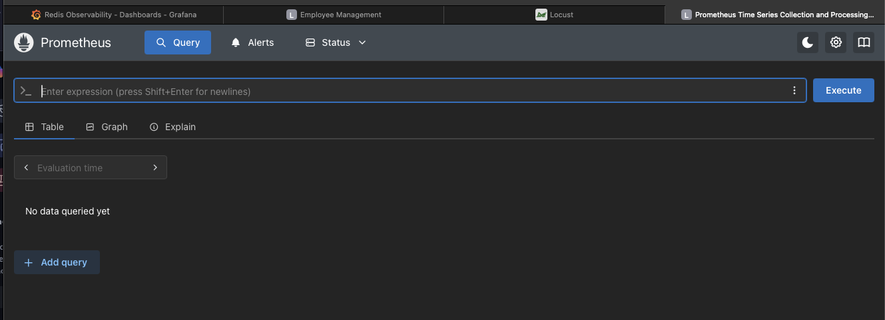
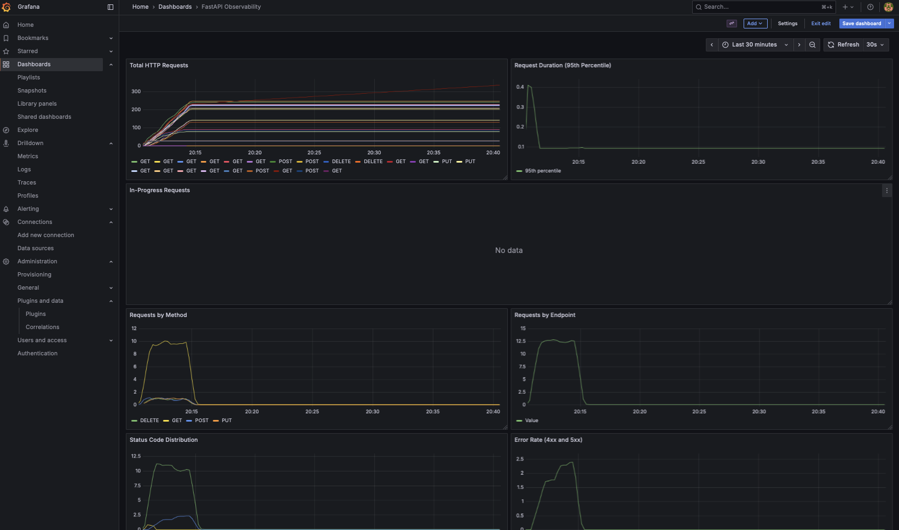
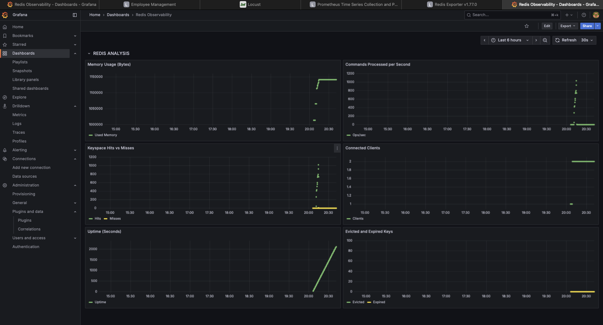
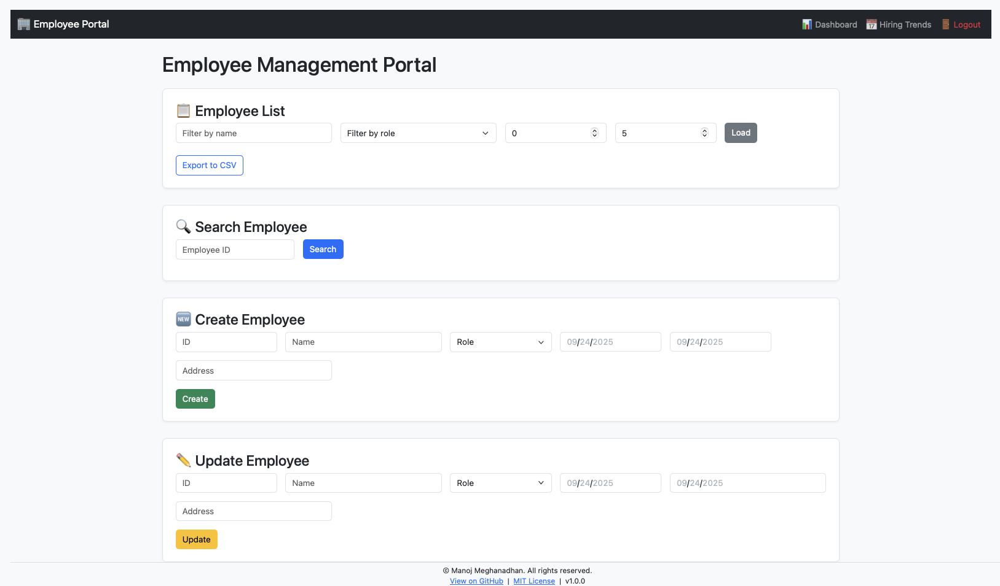
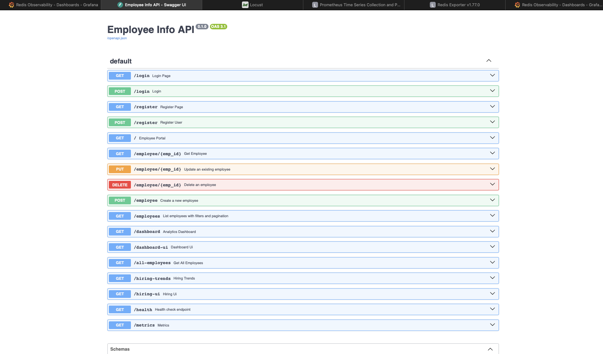
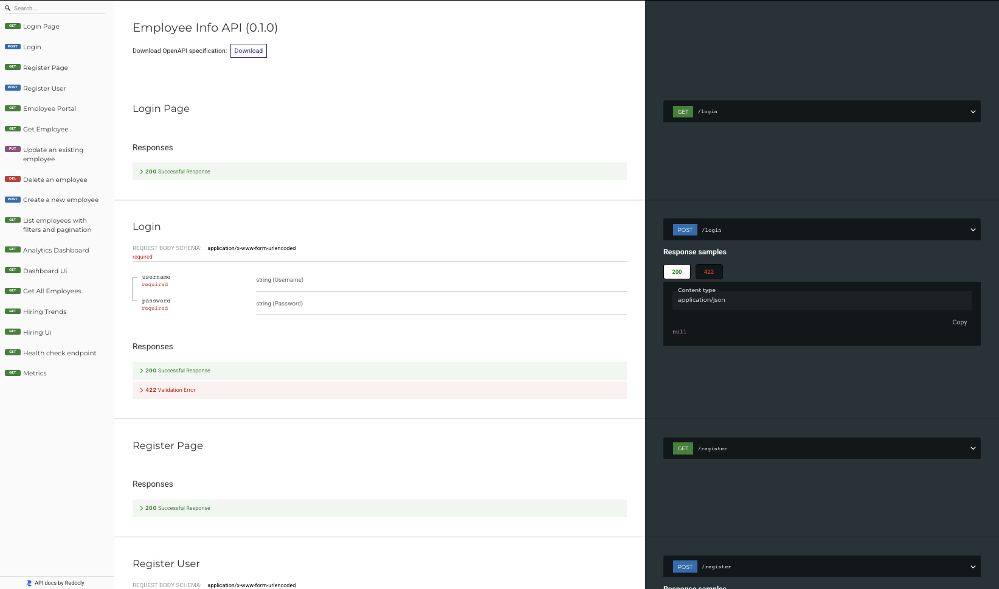
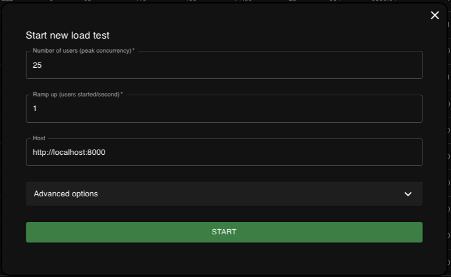
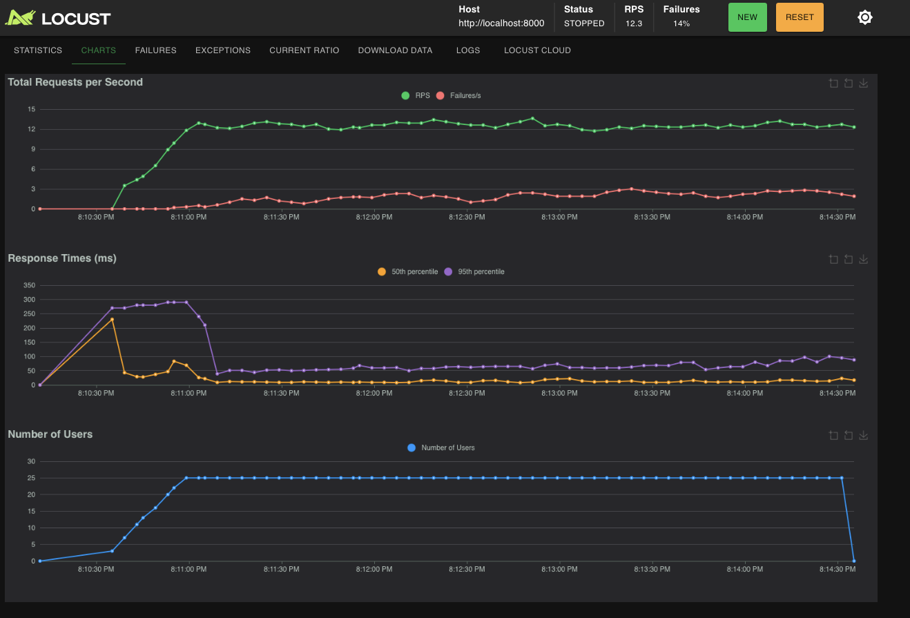

# 🧑‍💼 Employee Management Portal

A secure, scalable FastAPI-based web application for managing employee data, visualizing analytics, and tracking hiring trends. Built with Redis for storage, Bootstrap for UI, and Chart.js for dynamic dashboards.

---

## 🚀 Features

- 🔐 **Secure Authentication** — Cookie-based login and registration with password hashing
- 👥 **Employee CRUD** — Create, read, update, delete employee records
- 📊 **Analytics Dashboard** — Role distribution, age statistics, and live charts
- 📅 **Hiring Trends Dashboard** — Monthly hiring velocity with line chart
- 📥 **CSV Export** — Download all employee data in one click
- 🧠 **Logging** — All requests and actions logged to `app.log`
- 🧪 **Swagger Docs** — Auto-generated API documentation

---

## 🗂️ Folder Structure

employee-portal/ 
                 ├── main.py # FastAPI app with all routes   
                 ├── logger.py # Logging setup   
                 ├── app.log # Log file  
                 ├── templates/ # HTML pages   
                 │ ├── login.html   
                 │ ├── register.html   
                 │ ├── index.html   
                 │ ├── dashboard.html   
                 │ └── hiring.html   
                 ├── static/ # Optional CSS/JS assets   
                 └── README.md # This file  
                 └── redis_validate.py # validates the Redis connection  
                 └── requirements.txt # setup file for the app   
                 └── sample_setup.py # sets up the employee database with random data  

---

## 📚 API Routes

| Method | Path                  | Description                              |
|--------|-----------------------|------------------------------------------|
| GET    | `/login`              | Login page (HTML)                        |
| POST   | `/login`              | Authenticate user                        |
| GET    | `/register`           | Registration page (HTML)                 |
| POST   | `/register`           | Create new user                          |
| GET    | `/`                   | Employee portal (HTML)                   |
| POST   | `/employee`           | Create employee                          |
| PUT    | `/employee/{id}`      | Update employee                          |
| DELETE | `/employee/{id}`      | Delete employee                          |
| GET    | `/employee/{id}`      | Get employee by ID                       |
| GET    | `/employees`          | List employees with filters              |
| GET    | `/dashboard`          | Return analytics data (JSON)             |
| GET    | `/dashboard-ui`       | Dashboard page (HTML)                    |
| GET    | `/hiring-trends`      | Monthly hiring data (JSON)               |
| GET    | `/hiring-ui`          | Hiring trends page (HTML)                |
| GET    | `/all-employees`      | Download employee data as CSV            |
| GET    | `/health`             | Status Check of FastAPI                  |
_____________________________________________________________________________

---

## 🖥️ Pages

| Page         | URL Path           | Description                              |
|--------------|--------------------|------------------------------------------|
| Login        | `/login`           | User login form                          |
| Register     | `/register`        | New user registration                    |
| Portal       | `/`                | Employee form and list                   |
| Dashboard    | `/dashboard-ui`    | Role and age analytics                   |
| Hiring Trends| `/hiring-ui`       | Monthly hiring chart                     |

---

## 🛠️ Setup Instructions

1. All the containers are self sustained and needs docker installation in order to run 

For running all the containers please use the script run.sh which will cleanup and build all the images needed 

2. Ensure Docker Daemon is running , in order to deploy 

In case you want to Test and run locally we can use Docker alone or else you can use Docker compose commands 

docker compose build 
docker compose up -d 
 

3. Visit in browser

Login: http://localhost:8000/login

Dashboard: http://localhost:8000/dashboard-ui

Hiring Trends: http://localhost:8000/hiring-ui

📦 Data Model

class Employee(BaseModel):
    id: str
    name: str
    role: str
    date_of_birth: str  # YYYY-MM-DD
    date_of_hiring: str # YYYY-MM-DD
    address: str

Stored in Redis as JSON under key id.

📈 Logging
All requests and key actions are logged to app.log:

2025-09-20 00:45:12 - INFO - Login attempt for user: manoj
2025-09-20 00:45:13 - INFO - Employee created: 101

******************************************************************************

Containers setup for Docker Compose / Terraform / Simple Docker 

-- Fast API :  {Runs of Port 8000}

This is the standalone image , which hosts our Employee application and also the swagger and all the routes which are established. 

-- Redis-Init :  {Runs on port}
This image will deploy a REDIS database for usage with the Fast API app , launched with swagger docs 

-- Redis Exporter : 
This is used to actively tag and collect exported logs from REDIS and redirect towards the Prometheus tool. 

-- Prometheus : 
We have setup Prometheus as part of the infrastructure to log the fast api metrics as well as the REDIS  data to the promethueus data source 

-- Grafana : 
This image is used to actively show dashboard for viewing the dashboards for REDIS as well as the Faast api application. 

Employee Portal 

## 📑 Swagger & Docs

FastAPI auto-generates interactive API docs:

- 🔍 Swagger UI: [http://localhost:8000/docs](http://localhost:8000/docs)

- 📄 ReDoc: [http://localhost:8000/redoc](http://localhost:8000/redoc)

Use these to explore endpoints, test requests, and understand response formats.

**************************************************************************************

Performance Tests for data validation

We are using Locust for Fast api based Performance Testing once the docker images have been deployed

This has to be run from local by providing the URL for the run 

pip3.13 install locust

then start Locust 

locust -f LocustPerformanceTest.py --host http://localhost:8000

---

🤝 Contributing
Feel free to fork, extend, or modularize the app. Suggested improvements:

PostgreSQL or MongoDB backend

Role-based access control

Department-level dashboards

RESTful API versioning

📄 License
This project is licensed under the MIT License.

---
